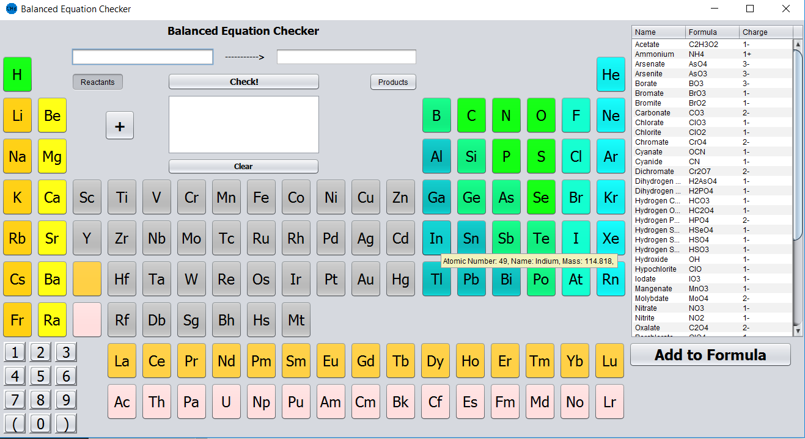
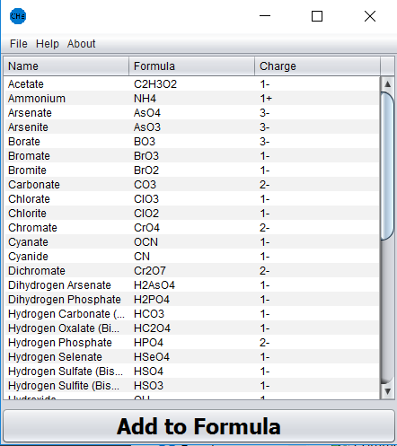

# C[He]mulator

## About the program

Screenshots below

### Welcome Menu

Choose which window to open

### Molar Mass Calculator

Enter a chemical formula and press calculate to find the molar mass and composition of each element.  Click an element button to add it to the formula or type it in.  If an element button is pressed more than once when entering a formula and it is the last element, the number after it is incremented by one.  The Common Names and Formula button opens a set of common formulas to make input easier.

### Balanced Equation Checker

Enter a chemical equation to and press check to see if the equation entered is balanced.  Click an element button to add it to the currently selected side of the equation.  If an element button is pressed more than once when entering a formula and it is the last element in the currently slected side of the equation, the number after it is incremented by one.  The table on the right  is a set of common formulas to make input easier.

### Common Names and Formulas

Select a compound by clicking on any of the boxes in its row, only choose one row though.  Click add to formula to add the selected value to the open Molar Mass Calculator window.  If that window is not open, the button does nothing.  New compounds can be added to the common names and formulas window under the File item in the toolbar.

## Installation
If you want to use the program, download the jar file in the dist folder and use that.  I plan to keep that up to date with any changes I make to the program.

If you want the source code, its all in the src folder, each folder in there is a package.  I wrote this program using the netbeans editor which created the forms for the GUI components.

## Screenshots

#### Welcome Menu

#### Molar Mass Calculator

#### Balanced Equation Checker

#### Common Names and Formulas

## Other Notes

The info sheets are from my high school chemistry class' periodic table, just copied into the program when I was making it for my reference.
